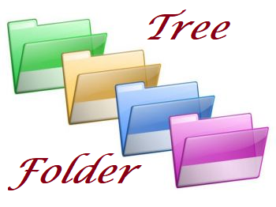

<p style="text-align:center">
  TREEFOLDER</p>
  <p></p>

<p style="text-align:center; clear:both;font-size:14px">
<strong>v1.0 del 08/02/2018</strong>
</p>
<div style="page-break-after: always">blah blah</div>


# 1. TREEFOLDER v1.0

<!-- TOC --> - [Indice](#1-treefolder-v10)
    - [1.1. Descrizione](#11-descrizione)
    - [1.2. Elenco di Cartelle di Base](#12-elenco-di-cartelle-di-base)
    - [1.3. Come utilizzare il programma](#13-come-utilizzare-il-programma)
    - [1.4. Sorgente del progamma](#14-sorgente-del-progamma)
<!-- /TOC -->
<p style="page-break-after: always;"></p>

## 1.1. Descrizione

Evoluzione del vecchio TREEPROJECT.bat.
$$1/((a+6)/255)$$

Dentro la cartella bin troverete l'eseguibile creato dal file *TreeFolder.ps1* e un file *TreeFolder.txt*
<center><b>NON MODIFICATE I NOMI DEI FILE!!!</b></center></br>
Avviate l'eseguibile, vi verrà rischiesto prima il nome del progetto, successivamente dovete creare la struttura delle cartelle se quella di default non vi aggrada.
Il presente File crea una struttura di cartelle per gestire un progetto software con diversi COMPILATORI/IDE o diversi O.S.
<p style="page-break-after: always;"></p>

## 1.2. Elenco di Cartelle di Base

*   __bin:__ Cartella utile per contenente gli eseguibili del progetto.
*   __Documentazione:__ Cartella utile per gestire la documentazione dei file sorgenti, con  guide readme ecc ecc.
    +   <u>*Doxygen:*</u>
    +   <u>*Html:*</u>
    +   <u>*Markdown:*</u>
    +   <u>*pdf:*</u>
*   __IDE:__ Utile a conterene i vari file di progetto per i diversi IDE-O.S.
    +   <u>*Windows:*</u>
    -   *Visual Studio*
    -   *CodeBlock*
    +   <u>*Linux:*</u>
    -   *CodeBlock*
*   __Licenze:__ Utile a contenere le varie licenze collegate al progetto.
*   __Sorgenti:__ Utile a contenere i sorgenti del progetto.

<p style="page-break-after: always;"></p>

## 1.3. Come utilizzare il programma
Modificare il file *TreeFolder.txt* secondo le proprie esigenze (o esigenze del progetto). Ogni riga deve conternere il percorso relativo della cartella da creare partendo da dentro la cartella base, senza il __".\\"__.
Non lasciare spazi tra un rigo e l'altro.
E' possibile usare spazi dentro il nome per le cartelle, il percorso non necessita di essere cacchiuso tra __" "__.

Esempio:


Avviare l'eseguibile TreeFolder.exe (o in alternativa, per chi volesse, può usare il file TreeFolder.ps1 contenuto nella cartella IDE, il file TreeFolder.exe è stato creato per avere ua maggiore semplicità di utilizzo). Seguire le indicazioni della console.
Inserire dapprima il nome del progetto:


e subito dopo il percorso assoluto di dove posizionare il progetto:


Se tutto è andato lisco alla posizione desiderata verrà a crearsi la cartella con il nome del progetto e dentro la struttura delle cartellle desiderata.

>  __N.B.__ In questa versione __NON__ sono presenti i file *.gitignore* dentro le  cartelle > vuote per l'utilizzo del sistema di controlo versione __GIT__.

<p style="page-break-after: always;"></p>

## 1.4. Sorgente del progamma

```{.PowerShell}
<# TREEFOLDER v_1.0

Copyright (C) 2018 Cannavo' Michele

Tutti i diritti Riservati

   TREEFOLDER is free software: you can redistribute it and/or modify
    it under the terms of the GNU General Public License as published by
    the Free Software Foundation, either version 3 of the License, or
    (at your option) any later version.
   TREEFOLDER is distributed in the hope that it will be useful,
    but WITHOUT ANY WARRANTY; without even the implied warranty of
    MERCHANTABILITY or FITNESS FOR A PARTICULAR PURPOSE. See the
    GNU General Public License for more details.
   You should have received a copy of the GNU General Public License
    along with TREEFOLDER. If not, see <http://www.gnu.org/licenses/>.
#>

# Inserire il nome del progetto, sarà la cartella principale
$nameProject = read-host -prompt "Nome     del progetto"

# Inserire il percorso di dove gestire il progetto.
# TODO: Lasciare vuoto per inserirlo nella stessa cartella
$dirWork     = read-host -prompt "Percorso del progetto"

# Salva l'attuale posizione per uso interno dello script
$actuallyDir = Get-Location


<# Controllo se il file TreeFolfder.txt è presente
   Se non lo e' esco dallo script #>
$FileExists = Test-Path  ".\TreeFolder.txt"
If ($FileExists -eq $False) {
    Write-Host "Non è stato trovato il file contenente l'elenco delle cartelle"
    Exit
}

# Legge il file e ne copia il contenuto nella variabile Computers
$Computers = Get-Content -Path .\TreeFolder.txt

# Mi sposto nella cartella dove creare il progetto
Set-Location -Path $dirWork
# e creo la cartella di base
New-Item -Path $nameProject -ItemType "directory"

# Serve a creare una vasriabile con il percorso della cartella base del progetto
$dirWork = $dirWork + "\" + $nameProject
# e mi ci sposto dentro
Set-Location -Path $dirWork

# Creo l'albero delle cartella come strutturato nel file TreeFolder.txt
New-Item -Path $Computers -ItemType "directory"


# Permette di vedere se tutto è andato liscio
$name = read-host -Prompt 'Premi un tasto per uscire'
```
