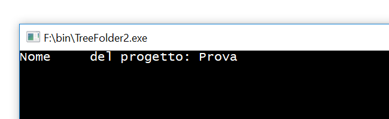

# 1. TREEFOLDER v1.0
<!-- TOC -->
- [1. TREEFOLDER v1.0](#1-treefolder-v10)
    - [1.1. Descrizione](#11-descrizione)
    - [1.2. Elenco di Cartelle di Base](#12-elenco-di-cartelle-di-base)
    - [1.3. Come utilizzare il programma](#13-come-utilizzare-il-programma)  
<!-- /TOC -->

## 1.1. Descrizione

Evoluzione del vecchio TREEPROJECT.bat.
Dentro la cartella bin troverete l'eseguibile creato dal file *TreeFolder.ps1* e un file *TreeFolder.txt*

<b>NON MODIFICATE I NOMI DEI FILE!!!</b>
 
Avviate l'eseguibile, vi verrà rischiesto prima il nome del progetto, successivamente dovete creare la struttura delle cartelle se quella di default non vi aggrada.
Il presente File crea una struttura di cartelle per gestire un progetto software con diversi COMPILATORI/IDE o diversi O.S.

## 1.2. Elenco di Cartelle di Base

*   __bin:__ Cartella utile per contenente gli eseguibili del progetto.
*   __Documentazione:__ Cartella utile per gestire la documentazione dei file sorgenti, con  guide readme ecc ecc.
    +   *Doxygen:*
    +   *Html:*
    +   *Markdown:*
    +   *pdf:*
*   __IDE:__ Utile a conterene i vari file di progetto per i diversi IDE-O.S.
    +   *Windows:*
        -   *Visual Studio*
        -   *CodeBlock*
    +   *Linux:*
        -   *CodeBlock*
*   __Licenze:__ Utile a contenere le varie licenze collegate al progetto.
*   __Sorgenti:__ Utile a contenere i sorgenti del progetto.

## 1.3. Come utilizzare il programma
Modificare il file *TreeFolder.txt* secondo le proprie esigenze (o esigenze del progetto). Ogni riga deve conternere il percorso relativo della cartella da creare partendo da dentro la cartella base, senza il __".\\"__.
Non lasciare spazi tra un rigo e l'altro.
E' possibile usare spazi dentro il nome per le cartelle, il percorso non necessita di essere cacchiuso tra __" "__.

Esempio:

Avviare l'eseguibile TreeFolder.exe (o in alternativa, per chi volesse, può usare il file TreeFolder.ps1 contenuto nella cartella IDE, il file TreeFolder.exe è stato creato per avere ua maggiore semplicità di utilizzo). Seguire le indicazioni della console.
Inserire dapprima il nome del progetto:

e subito dopo il percorso assoluto di dove posizionare il progetto:

Se tutto è andato lisco alla posizione desiderata verrà a crearsi la cartella con il nome del progetto e dentro la struttura delle cartellle desiderata.

>  __N.B.__ In questa versione __NON__ sono presenti i file *.gitignore* dentro le  cartelle > vuote per l'utilizzo del sistema di controlo versione __GIT__.